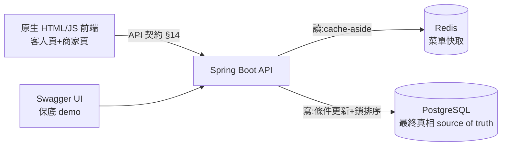
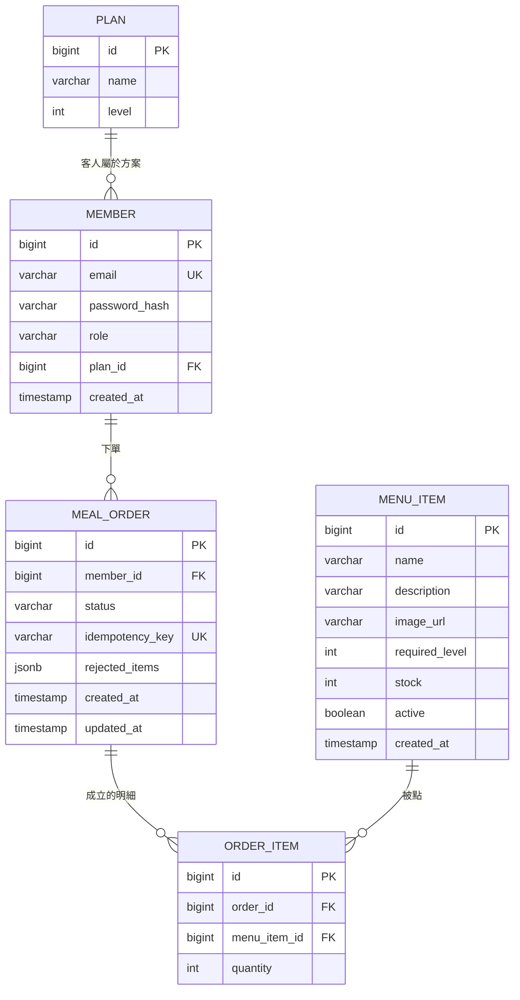
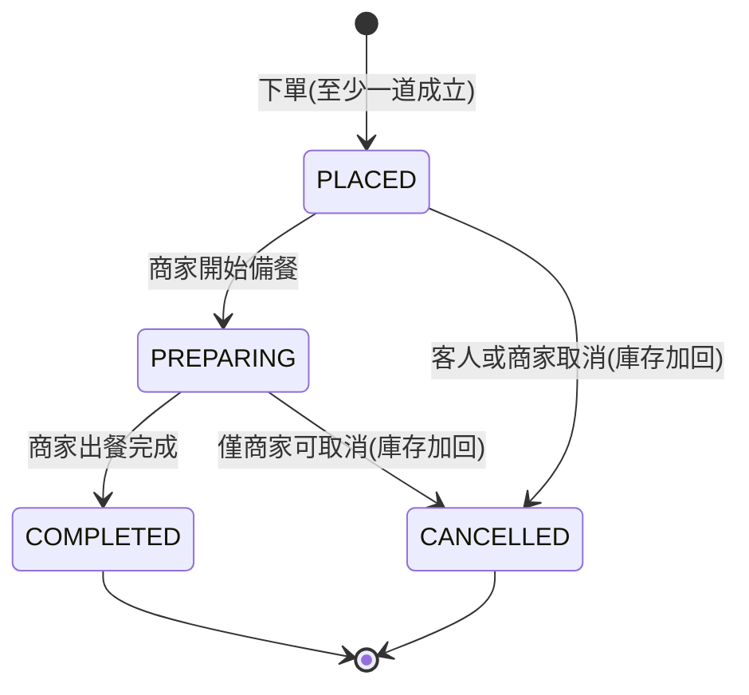

# EatRush(呷飽沒)— 吃到飽點餐與庫存系統 設計文件(最終版)

> 日期:2026-07-07(最終版,含權限重構 RBAC、前端兩頁、API 契約、OOP 型別設計)
> 作者:Harry
> 狀態:設計定案,待施工
> 定位:個人 side project(面試/履歷用),後端從零到上線全部自己寫
> 協作模式:**設計階段決策全定案(本文件即決策手冊+施工藍圖);實作全程 Harry 手刻,AI 只做卡關解說與排錯,不代寫**
> 備註:本文件先放 UcMarket repo 的 docs/,開新 repo 時隨專案帶走。同資料夾 KeyRush spec 為已審查通過的備選題材存檔

---

## 1. 專案定位與面試敘事

**一句話**:吃到飽餐廳的點餐後端,重點不在點餐,在**庫存(inventory)與權限(RBAC)** — 高併發點餐扣庫存、防超賣(oversell prevention)、部分成立、後台角色權限矩陣。

**題材敘事(README 第一段)**:台灣 bootcamp 畢業專案做點餐系統的很多,但幾乎全部止步於「菜單 CRUD + 訂單」— 菜單只是一張表,點餐不扣任何東西。EatRush 把沒人做的那一半做掉:菜有庫存、點餐是併發競爭、賣完是系統保證而不是店員喊的;後台有店長/店員權限分級,跟真實餐飲系統(iCHEF 等)同構。

**與 UcMarket 的對照敘事(面試核心賣點)**:

| | UcMarket 錢包 | EatRush 庫存 |
|---|---|---|
| 競爭資源 | 熱點帳戶餘額 | 限量菜庫存(多列) |
| 併發策略 | 悲觀鎖(pessimistic lock) | 條件更新(conditional update)+ 鎖排序(lock ordering) |
| 為什麼 | 扣款必須成功,寧可排隊等鎖 | 「售完」本來就是正確營業結果,快速失敗優於讓整間店排隊等鎖 |
| 失敗語意 | 等待後重試 | 該道菜立即回「售完」,整單部分成立 |

兩個專案合起來 = **「什麼場景選什麼鎖,我都實戰過」**。

**求職對口**:台灣餐飲 SaaS 產業(iCHEF、肚肚、inline、Ocard 等)— 這個專案等於「我懂你們的 domain,懂到庫存層和權限層」。

## 2. 範圍

### V1(後端約 3.5 週 + 前端 0.5 週)包含

- 會員註冊/登入,JWT(Spring Security 從零自己配)
- 三層授權:JWT 認證 / **RBAC 角色權限矩陣(method security)** / 方案等級資源規則
- 菜單管理(商家):建菜、上下架開關、**增量進貨**
- 點餐:冪等下單(佔位式)→ Validator 鏈分類 → 鎖排序多列條件扣減 → **部分成立(partial fulfillment)**
- 訂單狀態機:已下單 → 備餐中 → 已完成;取消(狀態=門票,庫存只加回一次)
- 估清:庫存歸零自動售完(推導),與商家手動下架(active)兩維度分離
- Redis:菜單查詢快取(手寫 cache-aside)
- 併發整合測試(Testcontainers 真 PostgreSQL)+ **兩個故意做壞實驗**
- **前端兩頁(原生 HTML/CSS/JS,demo 載具)**:客人頁、商家頁
- Docker Compose 一鍵起、GitHub Actions CI

### V1 明確不包含(防爛尾圍欄)

- 食材層/食譜 BOM(一道菜=一個庫存數字;BOM 是 V2 主菜)
- 金額/金流(吃到飽入場付費,點餐不涉錢 — 錢包是 UcMarket 的地盤)
- 圖片上傳(菜品圖只存 URL 字串;上傳=檔案儲存+安全,V2)
- 權限管理 API(V1 權限矩陣住 Role enum,§4.4;店長改權限的介面留 V2=§15-6,其前置=矩陣搬回 DB)
- 菜品分類 tab、列表分頁(5 道菜一頁放得下)
- 桌次、開桌、QR 掃碼(V2 配候位一起進)
- 逾時釋放/背景排程 — 內用點餐無「押單過期」天然場景,不硬造;排程在 V2 由「候位過號釋放」「每日開店庫存重置」承載
- refresh token(V1 只有 access token,被問就答「知道,在 roadmap」)

## 3. 技術棧與架構

後端:Java 21 + Spring Boot 3 + Maven + PostgreSQL 16 + Redis 7 + Flyway。前端:原生 HTML/CSS/JS,由 Spring Boot `static/` 直接服務(demo 載具,不美化,無建置鏈)。全套 Docker Compose。

選型理由(2026-07-07 審閱吵定):

- **PostgreSQL 16**(2026-07-07 修正重拍:查證 UcMarket 實際用 PG 非 MySQL,原「MySQL 同引擎」論述作廢,據實改選):①同引擎對照 — UcMarket 悲觀鎖與本案條件更新+唯一鍵**跑在同一顆 PG**,鎖策略對照才是同一套規則;②零切換成本 — 本機既有、手感既有(psql、role、連線排錯都實戰過),學習成本全留給賣點;③強交易 domain(訂單三表同生共死、庫存原子扣減)是 RDBMS 主場。**防身題**:「為何不用 MySQL?」— 這套設計在 MySQL 同樣成立;差異在深水區:InnoDB 預設 REPEATABLE READ、有間隙鎖(gap lock/next-key lock),PG 預設 READ COMMITTED、無間隙鎖;PG 另有 `UPDATE...RETURNING` 與可索引 JSONB — 講得出兩引擎差異,本身就是答案。「為何不用 MongoDB?」— 把強交易 domain 塞文件庫是逆著工具做事
- **Java 21**:最新 LTS,Boot 3.2+ 完整支援;virtual threads(虛擬執行緒)留作 V2 壓測現成話題
- **前端原生三家 HTML/CSS/JS(棄 Vue,再棄 React)**:前端不是本案賣點,學習成本全數花在賣點上 — React 不夠熟=失焦風險;無框架即無建置鏈(免 Node/Vite/CORS/proxy),頁面放 Spring `static/` 同源服務,`docker compose up` 一鍵連前端一起活;看板輪詢 `setInterval` 直寫,順帶避開 React stale closure 新手雷。**§14 契約定死=載具可拋棄**:未來換 React 重寫,後端一行不動(這句本身是面試題材)。React 履歷關鍵字由 UcMarket 承擔
- **Docker Compose(澄清:V1 用它起依賴環境,不是部署)**:①觀眾論 — UcMarket 觀眾是隊友,環境手工裝一次攤提掉;本案觀眾是陌生人(面試官),`git clone && docker compose up` 60 秒復活,否則 README 第二步就流失人;②環境即代碼 — 環境寫成進 git 的檔案才可重現(與 Flyway 管 schema 同一哲學:手動裝的必漂移);③招牌測試的地基 — Testcontainers 底層就是 Docker:Docker → Testcontainers → 真 PostgreSQL 併發測試 → 面試主菜
- **Flyway / Testcontainers**:「一次性設定型」工具,各約半天預習(攤在 Step 2/6 前夜),換得 schema 版控與真 PostgreSQL 測試 — 皆職缺常見詞。**防身題「為何不用 Atlas(宣告式)?」(2026-07-09 吵定)**:Flyway=命令式(imperative),人寫「路怎麼走」,所見即所得 — review 的 SQL 就是執行的 SQL,錯=人錯、review 可攔;Atlas=宣告式(declarative),人寫「終點」、路由 diff 引擎算(Terraform for databases)— 風險形狀不同:錯藏在生成環節(欄位改名被 diff 判成 DROP+ADD=資料蒸發;plan 預覽可緩解,但 plan 終究要人審=審核能力一分省不掉)。`ddl-auto=update` 就是爛版宣告式(Step 1 思考題),本案 validate+Flyway 的立場從第一天就是:schema 變更一律走人眼審過的 SQL;且 Atlas 甜蜜點(幾十表/多環境/drift 偵測)本案全無。判準:**審不動的自動化不是省力,是盲飛 — Atlas 之於 DDL,恰似 AI 之於 code:能力先於工具**(與 AGENTS.md 學習紅線同構)



兩條鐵律:

1. **PostgreSQL 是唯一真相(source of truth)**。所有庫存變動只發生在 DB;Redis 只是讀加速,**不參與防超賣**(「Redis 預扣」是 V2 的另一件事,屆時 PG 仍是最終真相)
2. **展示值可以騙人,交易路徑不能騙人**。菜單頁允許慢 3 秒;扣庫存那一行絕對即時且原子

**設計次序原則(本專案的方法論,面試可講)**:設計自 UI 始 — 畫面清單(§14)揭露資料需求(菜品圖→image_url 欄位),反推 API 契約,再反推表欄位;施工自 DB 始 — 依賴方向 DB→API→前端,契約定死後前端晚做零風險。

## 4. 資料模型(V1 五張表)— 每表為何存在、每欄的價值

> **DDL 風格決策(2026-07-08,Step 2 施工中定)**:①全案 VARCHAR **不給長度**(PG 合法且慣用,= 不限長;MySQL 不可 — 方言差異);長度驗證交應用層 `@Size`(Step 3)。有規格上限的欄(BCrypt hash=60、UUID=36、email RFC=254)的長度知識留在 dev-log,V1 不鎖 DB 層。②order_item 加**表級複合 UNIQUE**(見 §4.7)。③建表三層思考順序:身分(一列是什麼→PK)→ 事實(每欄型別+能不能空+DEFAULT)→ 防線(UK/FK);可空是例外不是預設,每個 nullable 要講得出「空的語意」。



### 4.1 plan(方案)— 為何存在:客人的消費資格分級(399/799),是「方案等級資源規則」(§7 第三層)的資料來源

| 欄位 | 存在的價值 |
|---|---|
| id | 主鍵。BIGINT 自增(全系統統一,UcMarket 的 UUID 型別地雷教訓) |
| name | 給人看的(「399 基本」);顯示用,不參與邏輯 |
| level | **給機器比的**。權益檢查 = `member.plan.level >= menu_item.required_level` 一行。為何不用 id 當等級:id 是身分不是順序 — 將來插入 499 方案,level 給 1.5 的位置(改成 15/20 這種留空隙的數列),id 不用動。**level 成立的前提**(2026-07-08 補):方案權益是商業承諾的鏈(chain,全序)— 貴方案永遠吃到所有便宜方案的菜,永不破,鏈才能壓成一個數字比大小;後台職能是偏序(互不包含),塞不進數線,所以那邊用矩陣(§4.5 Q1 對照;矩陣「住哪」是另一層決策 Q3 — V1 住 Role enum,§4.4)— 同一系統兩種授權形狀兩種解法 |

### 4.2 member(會員)— 為何存在:認證與授權的主體。每張訂單要能回答「誰點的」,每個後台操作要能回答「誰有權」

> **為何顧客與員工不分表**:分表兩訊號(專屬欄位差異大、行為幾乎不重疊)都不成立 — 共同行為「登入」正是主體(同一支 login、同一套 JWT/UserDetailsService),欄位差異只有 plan_id 一欄。分表的代價:login 雙源、email 唯一性變跨表檢查(應用層查重擋不住併發)、操作者外鍵引用分裂。將來員工資料變多,演化方向是加 `staff_profile`(member_id FK, 1:1)側寫表,不是拆主表 — 主體+profile 模式,登入永遠只查一張表。「顧客不能用員工功能」是 §7 RBAC 的職責,不是表結構的職責。

| 欄位 | 存在的價值 |
|---|---|
| email UK | 登入識別子;**唯一鍵在 DB 層防重複註冊** — 應用層檢查擋不住併發重複,唯一索引才是真防線(與冪等鍵同一哲學) |
| password_hash | BCrypt 單向雜湊。為何沒有 salt 欄:BCrypt 把 salt 編進 hash 字串本身 — 被問「鹽存哪」答得出來 |
| role | RBAC 錨點:CUSTOMER / STAFF / OWNER 三值,決定登入時載入哪組權限(§7) |
| plan_id(可空) | 客人有方案、員工沒有 — **可空是語意(員工不點餐),不是偷懶**。客人註冊時選定(register 帶 planId,省略預設 399)。反向講:若強制非空,就得造「員工假方案」污染資料 |
| created_at | 除錯與客服的時間錨點(「這帳號何時註冊的」) |

### 4.3 menu_item(菜)— 為何存在:庫存競爭的主戰場。stock 欄位是全系統併發焦點

| 欄位 | 存在的價值 |
|---|---|
| name | 顯示 + 訂單快照素材 |
| description(可空) | 前端卡片需要(§14 畫面反推);可空因為不是每道菜都要說故事 |
| image_url(可空) | **前端畫面反推出的欄位**(菜品卡片要圖)。V1 只存 URL 字串不做上傳 — 上傳是檔案儲存+安全的時間黑洞,V2。**為何不分表**:分表三訊號(1:N 多圖/檔案獨立生命週期/多處共用圖庫)一個都沒有 — 它本質是 varchar 屬性,與 name 同級;1:1 屬性硬拆 = 每查多一個 JOIN 零收益(過度正規化)。V2 做上傳時檔案才有生命週期,屆時建 attachment 表 + Flyway migration 搬遷 |
| required_level(預設 1) | 方案權益的另一半:預設 1 = 所有方案可點;特殊菜才標高。**預設值本身是語意**:新菜不設限是常態 |
| stock | **防超賣主戰場**。為何直接存不推導:競爭收斂到單列單欄的條件更新,正確性好證明;`COUNT(訂單)` 推導讓每次點餐變範圍查詢,又慢又難鎖 |
| active | 商家意志(「不賣了」),與 stock=0(系統事實「賣完了」)**兩維度分離** — 可點 = active AND stock>0,互不覆蓋。**為何不合併成單一 status 欄(ON_SALE/SOLD_OUT/OFF_SHELF)**:那是兩個獨立事實的有損壓縮 — 售完後取消回庫要「自動復活」(status 欄得靠人工同步改回,忘了就 bug);下架意志要在賣完/進貨後仍保留(status 欄會被系統覆蓋)。「售完」是 stock=0 的推導結果,不是要存的狀態。差別一句話:stock 只有系統動(交易路徑),active 只有商家動 — 誰的欄位誰動,永不打架 |
| created_at | 菜單排序預設依據(新菜在後) |

### 4.4 permission / role_permission — 為何「不」存在(2026-07-08 第三戰撤表:矩陣進 Role enum)

原設計:permission 表(權限清單:code UK 機器讀、name 人讀)+ role_permission 表(角色×權限矩陣,複合 PK)。老師一句「**要儲存、讀取才夠格放資料庫**」戳出第三個決策層(Q3 存放題),當日撤表 — 攻防全程見 §4.5 第三戰。

- **判準(磨準後)**:這張表 **runtime 有沒有 INSERT/UPDATE/DELETE?** 有=狀態(活資料)→ 住 DB;只在 seed 期寫過一次=規則/常數 → 住 code。氣味測試一句:**資料只出現在 seed 檔的表,就是在用資料庫存常數** — permission/role_permission 正中:seed 完就死,runtime 只剩登入時一句 SELECT。(對照 plan:V1 也 seed-only,但方案的天然主人是營運 — 改價/推新方案遲早是 runtime 寫入,預付合理,留)
- **改後形態**:Permission enum(原 code 欄=常數名;原 name 欄「人讀的」=enum 屬性)+ Role enum 建構子帶權限集合(`Set<Permission>`)— **矩陣沒有消失,每個角色常數出生自帶自己的權限**。同步點 1(全在 code;原 2 表版=enum+seed 兩處);加角色忘給集合=**編譯不過**(2 表版忘 seed=登入後權限空的,靜默)
- **原標題論點的訃聞**(原:「用表不用 enum,V2 加新權限只 INSERT 不改 code」):不成立 — 新權限必然伴隨新的受保護行為(新 API + @PreAuthorize)=必改 code 必部署;INSERT 省不掉部署,只是把清單搬離 code、多養一個同步點
- **何時搬回 DB(升級觸發)**:矩陣出現 **runtime 寫入需求**時 — §15-6 權限管理 API(店長後台勾選)或多租戶。具體訊號:**前端出現「儲存權限」按鈕的那一刻=runtime 寫入出現的那一刻=夠格進 DB 的那一刻**(判準會自己告訴你何時搬家)。
- **搬出 code 的另一個座位:外置組態檔+熱重載(2026-07-09 老師二招)**:矩陣放伺服器上不進 jar 的檔案,改檔+重讀(輪詢/監聽/手動 API)=伺服器層熱更新 — 但 token 層照樣要重登,且要自付三筆工程費(重讀觸發/綁 enum fail-fast/immutable+volatile 原子換版)。定位:它等於承認 runtime 要寫 → 與 DB 同格兩座位 — 檔案=單機低頻輕量位,**多實例/前端改/要審計=DB 位**(檔案做到完全體=自製無交易的窮人 DB)。V1 用不上(改動頻率 0),真主場=feature flag/營運參數(完整討論=dev-log `2026-07-09-dynamic-rbac.md`:熱置換/參數化鎖/升級階梯/邊界地圖)
- **前端能碰什麼的分界(2026-07-09 續戰)**:改**權限分配**(既有角色×既有權限重新勾)— 矩陣住 DB 就給得了前端(§15-6 本體);加**角色** — 連矩陣住 DB 也給不了:member.role 映射 `@Enumerated(EnumType.STRING)`,DB 冒出 enum 沒有的字串,JPA 讀取當場炸 — 要給得了,得代碼零角色感知(角色退化為 permission bundle,§4.5 二戰的封印,多租戶 IAM 檔位);加**權限** — 任何方案都給不了(新權限必伴隨新的受保護行為=code)。一句話:**前端能碰的只有「分配」;「行為」與「定義」住 code,前端永遠碰不到 — 決定權在「那個東西的定義住哪」,不在表數**搬家費近乎零:建兩表 + enum 集合抄成 seed + 登入從「拿 enum 屬性」改「查表」;`@PreAuthorize` **零改動**(Spring Security 只認 authorities 字串集合,不管字串從 enum 展開還是 JOIN 出來)。遷移便宜 → 不預付(對照 §4.5 Q1:level→矩陣搬家貴才預付矩陣 — **同一把尺,量出兩個答案**)

### 4.5 RBAC 三戰全紀錄:2 表 vs 3 表 vs 0 表 — 終局 0 表(矩陣進 Role enum),member.role 存裸 VARCHAR

> 原節名「role_permission(角色權限矩陣)」;該表已撤(§4.4),本節保留三場攻防沉澱的**三個獨立決策層** — Q1 形狀、Q2 鍵形式、Q3 存放。三層混講必卡(第一戰前三輪就是混講的代價);完整戰報在 dev-log rbac 篇。

**Q1 能力題 — 為何用矩陣,不用 level 比大小**:看權限關係的形狀。「越往上越開放」=鏈(chain,全序 total order)才能壓成一個數字 — §4.1 方案權益是商業承諾的鏈(貴方案吃到所有便宜的,永不破),故用 level。後台職能天生是**偏序(partial order)**:V1 的 STAFF⊂OWNER 恰好成鏈(當下 level 確實解得了,矩陣是預付),但已知變化點「會計/REPORT_VIEW」(§15-13 儀表板圈,§4.4 亦以此為例)一來就破 — 會計不能管訂單(level 須 <1)又要看報表(門檻須 ≤會計 level)→ 店員全看得到財務;一維數線裝不下互不包含的職能。遷移代價不對稱:level→矩陣=所有 @PreAuthorize 從比大小重寫成查權限,搬家貴 → 矩陣現在就建;至於矩陣的**預付形式**(表 or enum)是 Q3 的事 — 第三戰後=Role enum 各常數自帶權限集合(§4.4)。

**Q2 形式題 — 為何 2 表不 3 表(無 role 表)**:與 Q1 完全獨立 — 3 表(role/permission/role_permission 雙 FK)同樣是矩陣、能力等價,差別只是 role 這個鍵用**代理鍵(surrogate key,id 數字)還是自然鍵(natural key,'OWNER' 字串)**。代理鍵三個存在理由逐條不中:①自然鍵會變?role 是 Java enum 常數,改名=全 code 重構級事件,DB 防不了 ②太笨重?五個字元 ③有屬性要掛?零屬性(對照 permission 有 name 要掛才配表)→ 自然鍵直接躺進複合 PK(role, permission_id)。「'OWNER' 重複三列該抽表」是正規化錯覺 — 正規化消除的是**屬性值**重複(防 update anomaly),**鍵值**重複不歸它管(member_id 重複萬次無人消除);對照:'STOCK_MANAGE' 同樣以字串進 @PreAuthorize/JWT,無人不安。真相源(single source of truth)視角:role 集合封閉 → 真相源在 code(enum),DB 字串是引用;permission 開放 → 真相源在 DB(表)。

**升級觸發與業界對照**:判準一句話 = **角色由誰定義** — 工程師定義(行為在 code)→ enum+字串;營運者定義(角色是可配置資料)→ role 實體。三表殺手場景=多租戶 SaaS(每家店自訂「跑菜員/會計」,不可能改 enum 重部署)與通用 IAM(Keycloak 的 role 全表化,因平台不知業務);成立前提=代碼零 hasRole 寫死、授權全走 permission、角色退化為權限包(permission bundle)的名字。另一常見升級=一人多角(老闆兼會計)→ 加 user_role 中間表(業界完整 RBAC 五表:user/role/permission+兩張中間表);V1 member.role 單值=一人一角的刻意簡化。Spring Security 本身只認 GrantedAuthority 字串集合 — 其實連表都不要求(**0 表世界觀**):字串從 enum 展開或 JOIN 出來,框架不知也不問(這正是 Q3 搬家費近乎零的原因),更從不要求 role 是實體。

**終局戰(2026-07-08 同日二階段,Step 2 施工中 Harry 提議改 3 表,六輪後定案)— 純 2 表,連 CHECK 都不加**:

- **型別安全的位置**:「判斷角色」的 Java 句子任何方案都躲不掉,差別只在 typo 何時被抓 — 2 表版 `@Enumerated(EnumType.STRING)`+enum,`==` 比對**編譯期就死**;3 表版 member 存 role_id → Java 淪為數字比對(`roleId==1`,1 是誰?)或字串比對(runtime 才錯)或雙軌 enum(兩份清單人肉同步)。想把驗證搬進 DB(FK),實得是把型別安全踢出 Java — 淨損
- **FK 的真實能力**:只擋「不存在的 id」,不擋「填錯的 id」(role_id 2↔3 都合法且靜默;字串 'ONWER' 至少一眼假)— 3 表買不到「防打錯」
- **CHECK 不加**(曾提案後收回):`CHECK (role IN (...))` = 集合定義在 DB 的第二份複本,加角色的 migration 從 INSERT 變 ALTER、同步點+1;typo 真實暴露面=seed 四行、一次性,防線=enum 寫入路徑+Step 2 JOIN 驗證即抓 — 不值得第二份清單
- **擴充性總帳**(加一個角色):全程=①行為進 Java ②進清單 ③配權限 seed ④重部署;**瓶頸=①④,任何方案逃不掉**(V1 角色有寫死行為),3 表只把②的 ALTER 換成 INSERT=優化非瓶頸段。同步點數:純 2 表=2(enum+seed)< CHECK 版=3 = 3 表=3(enum+role 表+seed)。真擴充性=「不改 code 不部署調權限」— **矩陣本身已給**(改 role_permission 列+重登生效,§7),2 表就有;3 表獨賣的「不改 code 加角色」被 V1 架構(角色行為在 code)封印,付錢提不走貨
- **實戰 trace(加會計)**:enum 加一字+一支 INSERT-only migration(permission/role_permission/member 各一句)+部署 — role 欄是 varchar,**新字串直接進,它從來就沒關上**。角色新增成本由「矩陣裝不下的專屬行為量」決定(會計=純矩陣角色 0 專屬行為≈配置級;CUSTOMER 有 plan/點餐行為=貴),**與表數無關**。一人多角逼出的是 user_role 而非 role 表 — 且 user_role 的 role 欄照樣可存字串,連五表模型都不需要 role 實體

**第三戰(同日稍晚,老師參戰)— Q3 存放題:矩陣住 DB 還是住 code?終局改判 0 表**:

- 老師提案「矩陣存 Java 組態,不進 DB(寸土寸金)」。理由要換 — 矩陣+權限清單共 8 列是塵埃,DB 稀缺在熱路徑查詢與連線,不在空間;但**結論成立**,撐住它的是:同步點 1、typo 編譯期死、少兩張表一段 seed(細帳見 §4.4)
- **Q1/Q2 皆不受影響**:矩陣仍勝 level(Q1 問形狀);矩陣若落表,role 仍用自然鍵(Q2 問鍵形式)— Q3 只問「矩陣住哪」,三層正交
- **判準等價**:老師問「資料活不活(runtime 有無寫入)」≡ 我方問「改它的人是誰、能不能接受部署」— 兩問必同答。EatRush V1:矩陣改動≈0 次/年、改的人=工程師、重啟 30 秒可受 → 住 code
- **差異全景**:登入旅程只差一步(查表 JOIN ↔ 拿 enum 屬性),JWT / @PreAuthorize 一字不變;唯一真差別=改權限的動作(**UPDATE 一列重登生效 ↔ 改 enum 重部署+重登**)— 「不部署調權限」這能力 V1 用不到,要用時搬家費又近乎零(§4.4),不預付
- **立場更新紀錄**:AI 曾以「面試 demo(UPDATE 重登生效)+ DDL 已寫完」守 2 表,被打薄 — 老師本人即面試官直覺的樣本(見 seed-only 表第一反應「不夠格」),守表=替常數住 DB 辯護;沉沒成本不是理由。新敘事更強:「我知道矩陣**何時**該進 DB(runtime 寫入出現時),且知道搬家費近乎零」— 講判準,勝過講機制

### 4.6 meal_order(訂單)— 為何存在:交易的聚合根(aggregate root),狀態機的載體,冪等的錨點

| 欄位 | 存在的價值 |
|---|---|
| member_id | 「誰點的」— 取消時驗本人的依據 |
| status | 狀態機載體;**狀態=門票**:所有轉移用條件更新搶這一欄,取消只加回一次的保證就在這。**為何訂單可用 status 欄而菜不行(對照 §4.3)**:訂單狀態是單一事實的生命週期(同一時刻只在一個階段,互斥);菜的售完/下架是兩個並存的獨立事實 — status 欄裝流轉的狀態,不裝並存的事實 |
| idempotency_key UK | **佔位式冪等的核心**(§6.1):唯一索引讓同鍵第二個請求死在 INSERT — 應用層查重擋不住併發,唯一索引才是真防線 |
| rejected_items(JSONB) | 「沒點到清單」快照,冪等重放要回一模一樣的 body。**為何 rejected 用 JSON 而 accepted 用表(order_item)**:accepted 要參與取消加回與統計 = 需要關聯查詢;rejected 只為顯示回放 = 快照即可 — **按存取模式選儲存形式**,同一張單兩種答案,面試好題 |
| created_at / updated_at | 訂單看板排序、狀態最後變動時間(除錯:「這單何時變備餐的」) |

### 4.7 order_item(訂單明細)— 為何存在:一單多菜是 1:N,塞 JSON 進訂單就無法 join(取消加回要逐菜、熱門菜統計要聚合)— 關聯表是查詢與完整性的正解

| 欄位 | 存在的價值 |
|---|---|
| order_id / menu_item_id | 兩端外鍵,取消加回沿它找到要加回的菜;**兩欄皆 NOT NULL**(明細必屬於某張單、必對應某道菜 — REFERENCES 只管「指了要存在」,不管「必須指」,必填要自己宣告) |
| quantity | 份數;加回量 = 這欄,不靠猜 |
| UNIQUE(order_id, menu_item_id)(表級) | **同一張單裡同道菜只一列**,份數走 quantity — 防下單邏輯 bug 產生重複列(2026-07-08 Step 2 定,Harry 以 DDL 作答 D1 思考題)。教訓:單欄 UNIQUE(menu_item_id)=「全表唯一」= 每道菜全店史上只能被點一次 — UNIQUE 的作用域由「登記簿條目」決定:欄級約束視野=本欄,表級約束才寫得出組合唯一(詳 dev-log step2) |

**為何不能壓平成一張表(每道菜一列、訂單欄位跟著複製)**:訂單級事實(status / idempotency_key / member_id)會被複製 N 份 — ①idempotency_key 的唯一索引建不起來(同單 N 列同 key),佔位式冪等地基塌;②狀態門票裂成 N 張:取消與備餐各搶到不同列 → 同一張單一半 CANCELLED 一半 PREPARING,「只加回一次」的保證前提是**一張訂單的狀態恰好存在一列**;③改單級事實要改 N 列(update anomaly)。分表準則一句話:**一列=一個事實** — 「這次交易」一份事實住 meal_order,「單內含這道菜」N 份事實住 order_item(與 UcMarket wallet 餘額一列 / 流水表 N 列同款)。

### Seed 資料集(全部就這麼小,demo 一眼看完)

- 方案:399 基本(level 1)、799 豪華(level 2)
- 菜 5 道:牛肉麵(20 份)、乾拌麵(30)、肉片湯(15)、白麵(40)、**炙燒和牛(5 份,required_level=2,限量主角)**
- 帳號 4 個:店長(OWNER)、店員(STAFF)、399 客人、799 客人
- ~~權限 3 筆 + 矩陣~~(2026-07-08 撤:矩陣住 Role enum,§4.4 — seed 只剩「活資料」,正是判準的體現)

### 不變式(invariant)— 全系統的驗收標準

對每道菜,任何可觀察時刻:

```
本次觀測期間若無進貨:
stock(期初) = stock(期末) + Σ(期間內成立且未取消的明細份數)
```

白話:**帳實相符** — 少掉的每一份都能在活訂單裡找到;取消的每一份都回到庫存,且只回一次。所有寫路徑(下單扣、取消加、進貨加)都必須維持它;併發測試直接驗證它。

## 5. 訂單狀態機



### 轉移權限表(誰能動哪條線)

| 轉移 | 客人(本人) | 商家(含店員) | 實作 |
|---|---|---|---|
| PLACED → PREPARING | ✗ | ✓(ORDER_STATUS_MANAGE) | 條件更新 `WHERE status='PLACED'` |
| PREPARING → COMPLETED | ✗ | ✓(同上) | 條件更新 `WHERE status='PREPARING'` |
| PLACED → CANCELLED | ✓ | ✓(同上) | 條件更新 `WHERE status='PLACED'` |
| PREPARING → CANCELLED | ✗ | ✓(同上) | 條件更新 `WHERE status='PREPARING'` |

**狀態=門票**:每個轉移都是條件更新,影響列數 = 0 代表門票已被別人用掉(例:客人按取消的同一秒店員按了開始備餐)— 誰先更新誰贏,輸方安靜放棄,依現況回應(重複同一目標=200 冪等重放、衝突=409 與當前狀態,分流見 §6.2)。庫存加回只跟著「取消轉移的贏家」走,天然只加回一次 — 用資料庫原子性(atomicity)實作冪等,不需要任何鎖。

## 6. 核心流程敘事

### 6.1 POST /api/orders — 下單(全系統心臟)

1. **入參與冪等占位**:`{idempotencyKey, items: [{menuItemId, quantity}]}`,JWT 取 member;明細為空、份數超界或含重複菜 id → 422 整筆拒絕(malformed)。接著 **INSERT 佔位訂單列**(status=PLACED、尚無明細;交易提交前外部不可見):
   - 唯一鍵通過 → 本請求是贏家,續走第 2 步
   - 撞 `idempotency_key` 唯一鍵 → 本請求是輸家,**此刻零副作用**(還沒碰庫存),待贏家交易結束後於**新交易**讀其結果回放(200)— 手機重送不重複成單、不重複扣庫存。佔位放在第一步就是為了讓輸家死在起點,乾淨。角落 case 免特判:贏家若全拒回滾,唯一鍵隨之消失,等待中的輸家 INSERT 直接成功、自動變成新贏家重跑 —「撞鍵才算輸家」的定義天然涵蓋(選讀深水區:3 個以上同鍵同時佔位且贏家回滾,唯一索引的等待與喚醒在各引擎都有教科書級角落,demo 機率趨近零,知道即可)
2. **Validator 鏈逐道分類(不擋單,§10 OOP 主舞台)**:對單裡每道菜依 `List<OrderItemValidator>` 順序判定 — 菜 id 不存在 → rejected(ITEM_NOT_FOUND);`member.plan.level < required_level` → rejected(PLAN_NOT_ALLOWED);菜已下架 → rejected(ITEM_INACTIVE);其餘進入扣減候選
3. **鎖排序多列扣減(併發核心,經 StockDeductionStrategy 介面呼叫)**:候選菜**照 menu_item_id 升冪**逐道執行條件更新 `UPDATE menu_item SET stock = stock - :q WHERE id = :id AND stock >= :q`。影響列數 = 1 → accepted;= 0 → rejected(SOLD_OUT)。**排序是死鎖(deadlock)防線**:兩張單若以相反順序扣同兩道菜,各持一鎖等對方 = 死鎖;全系統統一升冪後,等待只會單向發生,永不成環。就算部分成立成敗互不影響,**成功扣減的列其行鎖(row lock)一路持有到交易結束**(PostgreSQL 預設 READ COMMITTED 亦然)— 兩張單反向扣同兩道菜照樣成環,**取鎖動作全程升冪,排序防線不省**。
   已知取捨(TOCTOU):active 在第 2 步判定、扣減在第 3 步,中間被商家下架的菜仍會扣成功 — 不把 active 塞進扣減的 WHERE,是為了讓 rows=0 唯一對應 SOLD_OUT、原因碼不受污染;V1 接受這個小窗口(面試談資,不是留白)
4. **成單(同一交易)**:至少一道 accepted → 對第 1 步的佔位列補上 accepted 明細 + rejected 快照(JSON);**全部 rejected → 拋例外整筆回滾(佔位列一併消失),回 409(ORDER_ALL_REJECTED),不留空單**。交易邊界:第 1-4 步同一 @Transactional — 要嘛完整成單、要嘛像沒發生過。
   刻意決策:全拒回滾代表冪等鍵**不落庫** — 同鍵重試視為全新請求(庫存若回來了就可能成單)。合理性:首次執行零副作用,重試自然等於新請求;把失敗回應也持久化(Stripe 式)是另一派,V1 不採,被問要答得出兩派差異
5. **交易提交後**:失效菜單快取;回 201,body 見 §14 契約 — 客人清楚看到哪些點到、哪些為什麼沒點到

### 6.2 POST /api/orders/{id}/cancel — 取消(庫存加回)

1. **權限**:JWT 驗本人(客人)或持 ORDER_STATUS_MANAGE 的商家;客人限 PLACED,商家可 PLACED/PREPARING(§5 轉移表)
2. **搶門票**:條件更新狀態 → CANCELLED,影響列數 = 0 → 查現況分流:已 CANCELLED → 200(冪等重放);已 COMPLETED → 409(ORDER_COMPLETED);PREPARING 且請求者是客人 → 409(PREPARING_CANNOT_CANCEL)
3. **加回庫存(同一交易)**:搶到門票才有資格加回 — 遍歷 accepted 明細,**同樣照 menu_item_id 升冪**執行 `stock = stock + :q`。加回也要排序:取消的加鎖順序若與下單的扣鎖順序相反,一樣會死鎖 — **全系統鐵律:凡動多列庫存,一律菜 id 升冪**
4. **交易提交後**:失效菜單快取
5. **回應**:200;不變式檢查點 — 這筆訂單佔用的每一份,恰好回到庫存一次

### 6.3 商家庫存操作 — 增量進貨(不是設值)

1. **只提供增量**:`POST /api/admin/menu-items/{id}/restock`,body `{delta}`(正=進貨,負=盤損),需 STOCK_MANAGE 權限
2. **為什麼不做「直接設成 N」**:商家設值的瞬間會蓋掉同時發生的客人扣減 — 商家讀到 stock=10、決定設成 50 的同一秒有人點掉 3 份,SET 50 讓那 3 份憑空回來(lost update)。增量 `stock = stock + :delta` 與客人的扣減天然可交換(commutative),誰先誰後結果都對 — **商家端也有併發問題,而且解法不是鎖,是把操作改成可交換的**(面試亮點)
3. **負增量防呆**:`WHERE stock + :delta >= 0`,盤損不可把庫存打成負數
4. 交易提交後失效菜單快取

### 6.4 GET /api/menu — 菜單(讀路徑,個人化組裝)

1. **全域層(走 Redis 快取)**:客人視角菜單(**已過濾 inactive** — 下架菜客人看不到)— 全店共用一份,cache-aside。商家要看原始清單(含 inactive 與庫存數字)走 GET /api/admin/menu-items 直查 DB,不經快取
2. **個人化層(不快取)**:`allowed = member.plan.level >= item.requiredLevel` 一行比大小(員工瀏覽時無方案 → allowed 一律 false,他們本來就不點餐)
3. **組裝回應**:每道菜標 `{soldOut, allowed}` — 快取的是全域事實,個人化在組裝層疊加;**個人化資料不進全域快取**(否則 399 客人的菜單會污染 799 客人看到的)

### 6.5 併發機制盤點 — 機制跟著競爭走,不跟著表走

**不是每個寫入都需要機制;機制只花在「有人搶」的寫入點上。**同一張表在不同寫入點可以用不同機制(meal_order 出生用唯一鍵、轉移用門票、填 JSON 裸寫):

| 寫入點 | 有人搶嗎? | 機制 |
|---|---|---|
| meal_order INSERT 佔位(6.1 第1步) | 有 — 同 idempotency_key 的重送請求搶「創建權」 | 唯一鍵搶佔(unique constraint) |
| meal_order 填 rejected_items JSON(6.1 第4步) | **沒有** — 本交易剛生的列,提交前外部不可見(隔離性 isolation) | 不需要 |
| order_item INSERT 明細(6.1 第4步) | **沒有** — 同上;且建立後不再改(immutable),無 lost update 可言 | 不需要 |
| meal_order.status 轉移(6.2 / 商家改狀態) | 有 — 客人取消 vs 商家備餐同時搶同一列 | 條件更新(狀態門票) |
| menu_item 扣庫存/加回(6.1 第3步 / 6.2) | 有 — **全店客人搶同幾列**(共享熱點) | 條件更新 + **id 升冪鎖排序** |
| menu_item 增量進貨(6.3) | 有 — 商家進貨 vs 客人扣減交錯 | 可交換增量(commutative delta) |

鎖排序鐵律**只**出現在 menu_item,因為死鎖要件是「多交易搶**同一組共享列**、取得順序相反」— menu_item 是全店共享(A 點牛肉麵+和牛、B 點和牛+牛肉麵);order_item 每筆交易只插**自己的新列**,沒有共享爭奪,故不需要排序。

## 7. 三層授權(authorization)設計 — 每層名正言順

| 層 | 問題 | 擋在哪 | 機制 |
|---|---|---|---|
| 1 認證(authentication) | 你是誰? | Security filter | JWT 驗簽,SecurityContext 載入會員與 authorities |
| 2 功能授權(RBAC) | 你的角色能用哪些後台功能? | **method security** | 登入時把 Role enum 自帶的權限集合(§4.4)展開進 JWT authorities;API 標 `@PreAuthorize("hasAuthority('STOCK_MANAGE')")` |
| 3 資源規則 | 你的方案能點這道菜嗎? | 業務層(Validator 鏈) | `plan.level >= required_level` 比大小 |

- **RBAC 動態性的已知取捨**:權限在登入時載入 token = 發 token 時的快照 — 改了矩陣(V1 矩陣在 enum:改 code 重部署;V2 矩陣搬回 DB 後:UPDATE 一列),已登入者都要**重新登入才生效**(JWT 無狀態的代價;每請求查庫可即時生效但多一次查詢,V1 不採)。**「熱生效嗎?」要拆兩層答(2026-07-09)**:伺服器層(要不要部署 — 矩陣在 DB=熱,在 enum=冷)× token 層(快照何時刷新 — 兩案都要重登,冷);2 表版=半熱,真全熱=每請求查庫或 token_version(§7.4)。面試被問「改權限何時生效」,這就是答案與取捨
- **面試必考:為什麼第 3 層不放 Security filter?** 它依賴業務資料(訂單內容 × 方案等級),filter 只看得到「請求者是誰」,看不懂「請求裡的每道菜」— 這是領域規則,放 Validator 鏈才拿得到完整上下文
- **demo 劇本**:店員登入按「進貨」→ 403(沒有 STOCK_MANAGE);店長同一顆按鈕 → 成功 — 權限矩陣看得見摸得著

### 7.4 token 管理:V1 取捨與追問防身(2026-07-08 補)

V1 定案:**單一 access token,時效 8 小時**(開發/demo 友善;生產環境應縮短並配 refresh)。「薄」是刻意圍欄 — demo 無真實資安邊界,火力砸併發;但以下四個必考追問要答得出第二層:

| 追問 | 防身答案 |
|---|---|
| 登出怎麼辦?JWT 無狀態怎麼撤銷? | V1 登出=前端刪 token(客戶端登出)。服務端撤銷三條路:①黑名單(Redis 存 jti 至到期)②短效 access+撤銷 refresh ③token 版本號(member 加 token_version,登出/改密碼 +1,驗證時比對)— v1.4 圈做 ③+refresh rotation |
| token 存哪?localStorage 不怕 XSS? | localStorage(XSS 風險)vs HttpOnly cookie(換來 CSRF 要另防)。V1 選 localStorage:原生三家無第三方腳本、XSS 面極小;講得出取捨即合格 |
| 為什麼不做 refresh token? | refresh 的價值=縮短 access 曝險窗+提供撤銷點;demo 場景曝險趨近零,加了是儀式不是安全。已排 v1.4 圈(rotation+撤銷) |
| 改了權限,已登入的人怎麼辦? | 權限在 authorities 裡=發 token 時的快照,重登生效(§7.2 取捨);要即時生效=版本號或每請求查庫,V2 權限管理 API 時一併考慮 |

**v1.4 登入安全強化圈(完全體後首選)**:refresh token rotation、登出撤銷(token_version)、access 縮短至 15 分 — 集中在 auth 模組,不動任何既有不變式。

## 8. Redis 快取設計(手寫 cache-aside,不用 @Cacheable)

**定位:Redis 在 V1 只負責「看菜單快」,防超賣 100% 是 PostgreSQL 條件更新的事。**

- 讀:`GET menu:all` → miss 則查 DB、回填、TTL 3 秒(±1 秒隨機抖動 jitter 防雪崩)
- 寫:任何庫存/菜單變動(下單、取消、進貨、上下架、建菜)交易**提交後** `DEL menu:all`(先更 DB 再刪快取)
- 為什麼 TTL 敢只給 3 秒、也敢容忍 3 秒舊值:菜單是展示值 — 客人看到「還有 5 份」到按下送出之間數字本來就會變,真話由扣庫存那行說;快取只需要擋住「全店狂刷菜單」的讀壓力
- **為什麼手寫不用 @Cacheable**:手刻學習目標 — 讀/回填/失效每一步自己寫過,才講得出 TTL、序列化、失效時機的細節;註解是黑盒
- V1 只快取這一個 key,做對一個用例勝過亂灑十個

## 9. 錯誤處理

統一格式 `{code, message, path, timestamp}`,`@RestControllerAdvice` 集中處理,catch 的是抽象基底 `BusinessException`(§10)。部分成立的「單內個別失敗」不是錯誤 — 它在 201 回應的 rejected 清單裡,**HTTP 層級錯誤只留給「整筆請求失敗」**。完整錯誤碼表見附錄 B。

## 10. 型別設計(OOP)— 抽象花在該花的地方

### 四個天然長出來的設計點

1. **`OrderItemValidator` interface + List 注入(§6.1 第 2 步)**:三個實作(NotFound / PlanLevel / Active),Spring `List<OrderItemValidator>` 自動組裝、`@Order` 排序。**V2 加「每人限購」= 新增一個類別,既有 code 一行不改** — 開閉原則(OCP)的活教材
2. **`BusinessException` 抽象階層(§9)**:abstract 基底帶 code + httpStatus 骨架,子類(StockUnderflowException、OrderCompletedException 等)填差異;@RestControllerAdvice 只 catch 基底,靠**多型(polymorphism)**分派 — abstract class 收斂共同骨架的正統用法。注意:**SOLD_OUT 不在此階層** — 售完是 rejected 原因碼不是例外(§6.1 rows=0 → rejected,不拋、不斷流),別把部分成立寫成拋例外
3. **`BaseEntity` @MappedSuperclass**:member / menu_item / meal_order 三個具 id+createdAt 的實體適用,配 JPA auditing — abstract 正統用法之二。plan / order_item **刻意不套**(§4 沒給它們 created_at:沒有審計需求的表不硬繼承 — 繼承也要 YAGNI)
4. **`StockDeductionStrategy` interface(§6.1 第 3 步)**:V1 實作=單菜條件扣減;V2 實作=BOM 食譜展開多列扣減。呼叫端第一天就面向介面,**V2 換實作時一行不動** — 抽象花在「已知的變化點」(BOM 明確在 roadmap 上),不是 YAGNI

### 刻意不用清單(比「用了什麼」更能打的那張表,進 README)

| 刻意不用 | 理由一句話 |
|---|---|
| 狀態機不用 State pattern | 狀態=門票靠 DB 條件更新的原子性,物件多型反而破壞它 |
| 快取不抽 interface | 沒有第二個實作的計畫,single-implementation interface 是反模式 |
| interface 不用 default method | 我擁有全部實作,不需要介面演化的相容層(它的主場是 JDK/函式庫那種管不到下游的場景) |
| permission / role_permission 不建表(曾設計,第三戰撤) | seed-only 表=用 DB 存常數(runtime 零寫入,不夠格進 DB — 老師的判準);矩陣進 Role enum:同步點 1、typo 編譯期死;搬回 DB 費近乎零(@PreAuthorize 零改動)→ 不預付(§4.4) |
| image_url 不另建圖片表 | 分表三訊號(1:N、獨立生命週期、多處引用)全缺 — 它是 varchar 屬性不是「圖片資源」;1:1 拆表=過度正規化。V2 上傳時檔案才有生命週期,屆時再分 |
| 不用 EAV 萬能表(entity/attribute/value 裝萬物) | 「加東西永不改 schema」的極限通用化=**內部平台效應(inner-platform effect)**:欄位變成列,UNIQUE 建不出(冪等地基塌)、NOT NULL/型別歸零、條件更新要 cast — 全套 DB 防線繳械。生死線:通用化「水管」(CRUD/id/錯誤格式 — JpaRepository/BaseEntity/Advice 已在做)✅,通用化「語意」(條件更新/狀態機/權限判斷)❌;加東西不改 code 的正確姿勢=把會增加的東西建模成**列**(加菜=INSERT 零 code) |

面試總結句:「我在扣庫存抽了介面因為 V2 就要換實作,在快取刻意不抽因為沒有第二實作 — **抽象要花在已知的變化點上,到處抽介面跟不抽一樣是不懂抽象**。」

## 11. 測試策略

- **單元測試**:狀態機轉移表逐條、Validator 鏈逐個、等級比大小邊界
- **併發搶購測試(招牌)**:Testcontainers 起**真 PostgreSQL**(H2 的鎖行為與 PG 不同,測併發等於測心安)。20 執行緒同一瞬間(CountDownLatch 放閘)各點 1 份和牛(庫存 5)→ 斷言:恰 5 單 accepted、stock=0、不變式成立、無負數
- **死鎖迴避測試**:兩組執行緒重複交錯下單(A 單:牛肉麵+和牛;B 單:和牛+牛肉麵)×100 輪 → 斷言:零 DeadlockLoserDataAccessException、帳實相符。fixture 自行 seed 大庫存(各 10000),確保百輪全程真扣減
- **冪等測試**:同一 idempotencyKey 連打 5 次 → 一張訂單、五次回應 **body 完全一致**(含 rejected 快照;狀態碼首次 201、重放 200)
- **取消競態測試**:取消與商家改狀態同時發生 → 恰一方贏、庫存正確
- **RBAC 測試**:店員(STAFF)打進貨 API → 403;店長(OWNER)→ 200;399 客人點和牛 → rejected(PLAN_NOT_ALLOWED)
- **兩個故意做壞實驗(正式交付物,截圖進 README)**:
  1. 把條件更新改成「先 SELECT 檢查再 UPDATE」→ 跑併發測試 → **親眼看庫存變負數** → 改回來
  2. 把鎖排序拿掉 → 跑死鎖測試 → **親眼看 deadlock 錯誤訊息** → 改回來

## 12. 施工順序(10 步)— 手刻導航

> 每步:交付/完成判準/**思考題(不想清楚別進下一步 — 它們就是面試考題)**/已知的坑

**Step 1|上工日(半天-1 天)**
交付:repo、Spring Boot 骨架連**本機 PostgreSQL**(UcMarket 既有那顆)、Flyway 就位、health API。**Docker 延後進場:Step 6 前夜裝 Desktop(Testcontainers 硬需求)、Step 8 才 compose 整包化** — 依賴到場時點=被需要時點,省下的 1-2 天進 Step 4 當 buffer。
判準:本機起服務 health 回 200;`SELECT version()` 確認連上 UcMarket 那顆 PG。
思考題:為什麼 schema 用 Flyway 管、JPA 只設 validate?(`ddl-auto=update` 在正式環境會發生什麼?)
坑:5432 被佔改埠;role 連不上先翻你們那篇 postgresql-test-troubleshooting(同一種錯)。

**Step 2|建表與 seed(1 天)**
交付:Flyway V1(五張表,§4)+ V2(seed:2 方案 5 菜 + 4 帳號)。
判準:重建資料庫再啟動,表就在、seed 看得到(Flyway 從零重建)。
思考題:§4 每張表「為何存在」你能不看文件講一遍嗎?rejected 用 JSON 而 accepted 用表的理由?
坑:PostgreSQL JSONB 欄位寫法;Flyway 檔名雙底線(V1__);權限矩陣**不建表**(§4.4 第三戰撤,矩陣住 Role enum)— Role/Permission enum 是 Step 7 的活,Step 2 沒有它們的事。

**Step 3|商家資料線(2-3 天)**
交付:建菜(含 imageUrl/description/requiredLevel)、上下架、增量進貨、菜單查詢(先無登入、無快取)。BaseEntity 與 BusinessException 階層在這步立起來。
判準:Swagger 建得出新菜,進貨後庫存正確。
思考題:為什麼進貨是「+N」不是「設成 N」?lost update 發生的精確瞬間在哪?
坑:@RestControllerAdvice 統一錯誤格式這步立好,後面全沿用。

**Step 4|點餐心臟(4-5 天)**
交付:下單全流程(佔位冪等 → Validator 鏈 → StockDeductionStrategy 鎖排序扣減 → 部分成立成單)。會員先用 seed 的測試客人 id 帶參數。
判準:**開兩個 Swagger 視窗同時搶最後 1 份和牛 — 一單 accepted、一單 rejected(SOLD_OUT)**。
思考題:「先查再扣」錯在哪個瞬間?為什麼排序保證永不死鎖(畫出成環等待,再畫出排序後為什麼成不了環)?佔位為什麼放第一步?全拒為什麼回滾而不是留空單?
坑一:`@Modifying` JPQL 繞過 persistence context(一級快取)— 更新後同交易內再讀該 entity 會是舊值,要 `clearAutomatically = true`。
坑二:冪等輸家的 catch 與回放查詢必須在**失敗交易之外** — 撞唯一鍵後原交易已 rollback-only,同一個 @Transactional 方法裡 catch 後繼續查會踩 `UnexpectedRollbackException`;且 Spring 代理下同類別自呼叫(self-invocation)不會開新交易 — 回放邏輯拆到另一個 bean(或 Controller 層)。

**Step 5|取消與估清(2 天)**
交付:取消(門票+排序加回)、商家改狀態兩支、菜單 soldOut/allowed 標記(allowed 先用假會員的方案算)。
判準:demo 一整圈 — 搶完 → 售完 → 取消一單 → 又能點。
思考題:連按兩次取消,第二次為什麼自然無效?加回為什麼也要照升冪排序?
坑:取消的「查現況分流」窮舉所有狀態,別留 else 黑洞。

**Step 6|併發自動測試(3 天)**
交付:§11 全部測試 + 兩個故意做壞實驗(截圖存檔)。
判準:測試綠燈進 CI;負庫存與 deadlock 兩張「事故截圖」到手。
思考題:為什麼斷言不變式等式而不是「功能正常」?等式少寫「未取消」三個字漏掉什麼?
坑:**前夜先裝 Docker Desktop 並 pull postgres:16**(Docker 在此進場);Testcontainers 首跑拉 image 慢;CountDownLatch 放閘寫法;**併發測試類不掛 @Transactional**(子執行緒不在同一交易,掛了會有測試回滾假象 — 清資料用 @BeforeEach 手動重置)。

**Step 7|裝門:JWT 與三層授權(3-4 天)**
交付:註冊/登入/發 token(authorities = Role enum 自帶權限集合展開,§4.4)、@PreAuthorize 上鎖、假會員全面換成 SecurityContext 真會員(Validator 鏈 Step 4 已完整,這步只換「會員從哪來」)。
判準:無 token 點餐 → 401;399 客人點和牛 → rejected(PLAN_NOT_ALLOWED);**店員按進貨 → 403,店長 → 200**。
思考題:三層授權各擋在哪?為什麼方案等級不放 filter?改了權限矩陣,已登入的店員何時生效、為什麼?
坑:**Spring Boot 3 只能用 SecurityFilterChain bean 寫法 — 網路上大量舊教學用 `WebSecurityConfigurerAdapter`(已移除),照抄必炸**;method security 要開 `@EnableMethodSecurity`;cancel 的授權是「本人 OR ORDER_STATUS_MANAGE」混合式 — @PreAuthorize 一行寫不了,ownership 判斷落在 service 層(與 §7 分層一致,別硬塞 SpEL);401/403 排錯順序:filter 順序 → token 有沒有真的帶到 → 最後才懷疑配置。

**Step 8|快取與包裝(3-4 天)**
交付:手寫 cache-aside 菜單快取、GitHub Actions CI、README(架構圖、決策的為什麼、刻意不用清單、兩張事故截圖)、整包容器化。
判準:**別人 clone 下來,一個指令跑起來**;CI 綠勾。
思考題:先更 DB 再刪快取,反過來會怎樣?哪些資料絕對不准進快取(個人化 allowed)?
坑:快取失效放交易**提交後**(`@TransactionalEventListener(AFTER_COMMIT)`),不然回滾了快取卻已被刪。

**Step 9|前端兩頁(2-3 天,原生 HTML/CSS/JS,Spring static/ 同源服務)**
交付:客人頁(登入 → 菜單卡片牆(圖/售完/可點)→ 點餐 → 我的訂單含「沒點到」提示)、商家頁(登入 → 庫存進貨/上下架 → 訂單看板改狀態)。
判準:**兩個瀏覽器視窗搶最後一份和牛,畫面直接看到一邊成功一邊售完** — demo 主戲台。
定位:demo 載具,能跑就好不美化,README 明寫「前端為 demo 載具,重點在後端」。
砍法順序(時程爆炸時從後砍):① 砍商家頁(商家操作用 Swagger)→ ② 砍客人頁美化 → ③ 全砍(Swagger 保底)。**永遠不砍:Step 4-6。**

**Step 10|發版 v1.0(半天)**
交付:README 定稿(架構圖/決策的為什麼/刻意不用清單/事故截圖/一鍵起指令)、`git tag v1.0` + GitHub Release、(可選)90 秒 demo 片。
判準:陌生機器 clone → `docker compose up` → demo 走通;Release 頁可見 v1.0。
此後進入大閉環(見 playbook 大閉環章):功能圈 v1.1 限購 → v1.2 BOM → v1.3 KDS,壓測體檢隨行。

## 13. 時間軸對照(投遞與開發平行)

| 里程碑 | 累計 | 狀態 | 投遞策略 |
|---|---|---|---|
| M1 | ~1.5 週 | Step 1-4:心臟會跳(兩視窗搶最後一份) | 可開始投,README 掛 roadmap |
| M2 | ~2.5 週 | Step 5-6:測試綠燈+事故截圖 | 面試主菜上桌,大量投 |
| M3 | ~3.5 週 | Step 7-8:後端完全體(門+快取+CI+README) | 火力全開 |
| M3.5 | ~4 週 | Step 9-10:前端 demo 戲台+發版 v1.0 | demo 效果十倍 |
| M4+ | 之後每 1-2 週 | V2 逐項(見 §15) | 面試被問「然後呢」永遠有下一章 |

## 14. 前端規格與 API 契約(前後端資料流轉,今天定死不返工)

### 畫面清單(五個,全部)

| 畫面 | 內容 | 用到的 API |
|---|---|---|
| 登入/註冊 | email+密碼;登入後按角色跳轉 | register / login |
| 客人・菜單 | 卡片牆:圖、名、描述、售完標記、可點標記;購物籃(前端暫存);送單 | menu / orders |
| 客人・我的訂單 | 列表:狀態、明細、「沒點到」提示;取消鈕 | orders/me / cancel |
| 商家・菜單庫存 | 菜列表(圖、庫存、active 開關、進貨鈕)、建菜表單 | admin GET menu-items / 建菜 / PATCH / restock |
| 商家・訂單看板 | 各狀態訂單、改狀態鈕;**新單靠前端輪詢(polling)**(setInterval 約 5 秒重拉,內用場景夠用;伺服器推播 SSE/WebSocket 是 V1 圍欄外,見 §15-12) | admin GET orders / status |

### 核心契約(JSON 定死;其餘 CRUD 約定 = 表欄位 camelCase)

**POST /api/auth/register** ← `{ email, password, planId? }`(planId 省略預設 399/level 1)→ 201

**POST /api/auth/login** ← `{ email, password }` → `{ token, role }`(前端按 role 跳客人頁或商家頁)

**GET /api/menu** →
`{ items: [{ id, name, description, imageUrl, requiredLevel, soldOut, allowed }] }`

**POST /api/orders** ←
`{ idempotencyKey, items: [{ menuItemId, quantity }] }`
→ 201(重放 200):
`{ orderId, status, accepted: [{ menuItemId, name, quantity }], rejected: [{ menuItemId, name, reason }] }`

**GET /api/orders/me** →
`{ orders: [{ orderId, status, createdAt, accepted: [...], rejected: [...] }] }`

重放語意(定死):**rejected 與首次完全一致** — 直接吐 rejected_items 快照、不重新 join(菜改名也不破快照);快照形狀即契約物件 `{menuItemId, name, reason}`,ITEM_NOT_FOUND 的 name 為 null(幽靈 id 本來就 join 不到名字)。**accepted 的 name 重 join 取當前值**(order_item 不存菜名 §4.7;菜改名時 accepted 顯示新名 — 與 status 同款「反映現況」語意,不是不一致)。`status` 反映**當前**狀態(取消後重放看到 CANCELLED — 這是對的行為)。

**POST /api/admin/menu-items/{id}/restock** ← `{ delta }` → `{ id, stock }`(回新庫存,前端直接刷畫面)

錯誤一律 `{ code, message, path, timestamp }`。前端只依賴本節契約;後端 Swagger 自動文件化它。

## 15. V2 與 roadmap(壓測驅動,防提前做完)

V1 完成後先 k6 壓測建基線,之後每個擴充都是「解一個實測瓶頸或補一個真缺口」。**施工循環(選題→mini-spec→施工→全量回歸→tag 發版→retro)見 playbook「大閉環」章** — 功能項=一圈(一次對外可見的版本更新);壓測/預扣等品質項走支線不佔圈:

1. **k6 壓測報告**:RPS、p99 進 README — 有數字的專案跟沒數字的是兩個世界
2. **食材層 BOM(本題材真正的大招)**:食材表+食譜展開,`StockDeductionStrategy` 換第二實作(§10 的介面此時兌現);**肉片被多道菜共用 = 跨商品共享熱點** — 點不同的菜搶同一份食材;估清升級為「任一食材不足→用到它的菜連動售完」
3. **每人限購**:Validator 鏈加一個類別(§10 的 OCP 此時兌現)
4. **候位系統**:發號、過號自動釋放 — **排程與 TTL 競態在此天然回歸**;叫號認領=`FOR UPDATE SKIP LOCKED` 的天然舞台(KeyRush 存檔的獨門技在此兌現,該專案不另做)
5. **每日開店庫存重置**:營業日+排程(排程第二場景)
6. **權限管理 API 與畫面**:店長後台動態調權限矩陣 — **本圈前置=矩陣從 enum 搬回 DB**(runtime 寫入自此出現=夠格進 DB;搬家費近乎零:建兩表+enum 集合抄成 seed+登入改查表,@PreAuthorize 零改動 — §4.4「升級觸發」的兌現點)
7. **圖片上傳**:multipart → 本地/物件儲存(V1 只存 URL)
8. **Redis 預扣(Lua script)**:壓測發現 DB 行鎖瓶頸後,DB 前加一層原子預扣 — 此時才輪到「Redis 參與防超賣」
9. **refresh token + 桌次 QR**:短效 access + refresh;掃 QR 開桌發桌次 JWT,**用餐 90 分鐘 = token exp** — 業務規則與技術機制同構的彩蛋
10. **MQ 削峰(RabbitMQ)**:下單改非同步 + outbox pattern
11. **對照實驗文章**:同場景悲觀鎖/樂觀鎖 @Version 各實作一版 benchmark
12. **工作站出單(kitchen station / KDS)**:menu_item 加 station 欄,出單畫面=order_item 按站投影(一句 JOIN,不加新表);狀態下沉到明細(order_item 加 PENDING/DONE,兩廚師搶同一道=同一句條件更新);整單 COMPLETED 改為「全明細 DONE」的推導(與估清同款「推導不儲存」);新單即時推播(SSE/WebSocket)取代輪詢也在此進場。深水區:最後兩道菜同時完成誰標整單(last-one-out 問題)。可順手收**出餐口(expo)端**:跑菜員螢幕=「DONE 待送」投影,建模成一個特殊站,零新技術
13. **老闆儀表板(dashboard)**:今日銷量、熱門菜、食材消耗 — 唯一「聚合型」投影端(GROUP BY 讀模型),§4.5 Q1 會計反例埋的 REPORT_VIEW 在此兌現(Permission enum 加一個常數);帶出讀模型(read model)面試話題
14. **auth 抽離成獨立會員服務(v2.0 候選,前置=v1.4)**:把做深後的 auth 模組抽成獨立服務,EatRush 變它的第一個 client — 單體抽服務的真實痛(跨服務 token 驗證、member 表切分、CORS/gateway)才是微服務面試題的本體;敘事「先在單體做深、再抽離」勝過憑空新建會員系統(bootcamp 爛大街題,無區隔)

---

## 附錄 A:關鍵 SQL / JPQL(實作對照用;正文零 code 原則,細節收這裡)

```sql
-- 防超賣:原子條件扣減(6.1 第3步)— 心臟的那一行
UPDATE menu_item SET stock = stock - :q
WHERE id = :id AND stock >= :q;
-- affected rows: 1=accepted, 0=rejected(SOLD_OUT)

-- 取消搶門票(6.2)
UPDATE meal_order SET status = 'CANCELLED', updated_at = NOW()
WHERE id = :id AND status = 'PLACED';
-- affected = 1 才有資格加回庫存(照 id 升冪):
UPDATE menu_item SET stock = stock + :q WHERE id = :id;

-- 商家增量進貨/盤損(6.3)
UPDATE menu_item SET stock = stock + :delta
WHERE id = :id AND stock + :delta >= 0;
```

```java
// JPA 版扣減(Step 4 坑一併記):
@Modifying(clearAutomatically = true)  // 不加:同交易內讀到舊 entity
@Query("UPDATE MenuItem m SET m.stock = m.stock - :q " +
       "WHERE m.id = :id AND m.stock >= :q")
int tryDeduct(@Param("id") Long id, @Param("q") int q);
// 呼叫端:候選清單先 sort by menuItemId 升冪再逐一 tryDeduct — 鎖排序鐵律

// method security(§7 第二層)
@PreAuthorize("hasAuthority('STOCK_MANAGE')")
public StockResponse restock(Long id, int delta) { ... }

// 併發測試放閘(Step 6)
CountDownLatch gate = new CountDownLatch(1);
// 20 threads: gate.await() → POST /api/orders(和牛×1)
// gate.countDown() 同時放行
// 斷言:accepted 總數==5, stock==0, 不變式等式成立
```

## 附錄 B:API 簡表、錯誤碼、rejected 原因碼、決策總表

### API(V1 共 12 支)

| API | 方法 | 授權 | 說明 |
|---|---|---|---|
| /api/auth/register | POST | 公開 | 註冊(email+密碼 BCrypt+選方案,預設 399),只能建 CUSTOMER |
| /api/auth/login | POST | 公開 | 登入,回 JWT(authorities 含權限矩陣) |
| /api/menu | GET | 登入 | 菜單:全域快取+個人化 allowed 組裝(6.4) |
| /api/orders | POST | CUSTOMER | 冪等下單,部分成立(6.1) |
| /api/orders/{id}/cancel | POST | 本人或 ORDER_STATUS_MANAGE | 取消(6.2) |
| /api/orders/me | GET | CUSTOMER | 我的訂單(含 rejected 快照) |
| /api/admin/menu-items | GET | 後台角色(STAFF/OWNER) | 菜單庫存原始值(含 inactive 與 stock 數字,商家管理頁用;直查 DB 不經快取)|
| /api/admin/orders | GET | 後台角色(STAFF/OWNER) | 訂單看板列表(?status= 過濾)— 讀寬寫嚴:讀取用角色擋,寫入才用 permission |
| /api/admin/menu-items | POST | MENU_MANAGE | 建菜(name/description/imageUrl/requiredLevel/初始stock) |
| /api/admin/menu-items/{id} | PATCH | MENU_MANAGE | 上下架 active 開關 |
| /api/admin/menu-items/{id}/restock | POST | STOCK_MANAGE | 增量進貨/盤損(6.3) |
| /api/admin/orders/{id}/status | PATCH | ORDER_STATUS_MANAGE | PLACED→PREPARING→COMPLETED |

### HTTP 層錯誤碼(整筆請求失敗才用;單內個別失敗走 rejected 清單)

| 錯誤碼 | HTTP | 情境 |
|---|---|---|
| ORDER_ALL_REJECTED | 409 | 整單沒有任何一道成立 |
| ORDER_COMPLETED | 409 | 取消已完成的訂單 |
| PREPARING_CANNOT_CANCEL | 409 | 客人取消備餐中訂單(商家才可以) |
| INVALID_STATUS_TRANSITION | 409 | 商家改狀態不符轉移表 |
| ORDER_NOT_FOUND | 404 | 訂單不存在或非本人 |
| ITEM_NOT_FOUND | 404 | 菜不存在(admin 路徑參數用) |
| STOCK_UNDERFLOW | 409 | 盤損負增量會使庫存變負 |
| INVALID_QUANTITY | 422 | 份數非 1–10、明細為空或含重複菜 id |
| UNAUTHORIZED | 401 | JWT 無效或過期 |
| FORBIDDEN | 403 | 角色/權限不符(店員打進貨 API) |

### rejected 原因碼(201 回應內,逐道菜)

| 原因碼 | 意義 |
|---|---|
| SOLD_OUT | 庫存不足(條件更新輸了) |
| PLAN_NOT_ALLOWED | 方案等級低於菜品要求(第三層規則擋下) |
| ITEM_INACTIVE | 商家已下架 |
| ITEM_NOT_FOUND | 菜 id 不存在(與 HTTP 404 同名不同層:這裡是單內逐道原因) |

### 決策總覽(全部定案一行掃完)

Java 21+Maven / **PostgreSQL 16(與 UcMarket 同引擎)** / Flyway+validate / 依層分包(by-layer)套件 / BIGINT id / **RBAC 矩陣住 Role enum(0 表;runtime 寫入出現才搬回 DB,§4.4)+方案等級欄** / 三角色 CUSTOMER-STAFF-OWNER / 佔位式冪等 client UUID / 部分成立+rejected JSON 快照 / 鎖排序鐵律(扣與加回皆升冪)/ 增量進貨 / **菜品圖只存 URL** / Validator 鏈+StockDeductionStrategy 介面+刻意不用清單 / Testcontainers 真 PostgreSQL / JUnit 多執行緒(k6 留 M4)/ SecurityFilterChain 新式+@EnableMethodSecurity+jjwt+BCrypt / access token only(權限進 authorities=發 token 時快照,改矩陣後重登生效)/ 手寫 cache-aside / **前端原生三家兩頁 demo 載具(Spring static 同源,Step 9,可砍)** / API 契約 §14 定死 / CI=build+test / README 中文主英文括號
