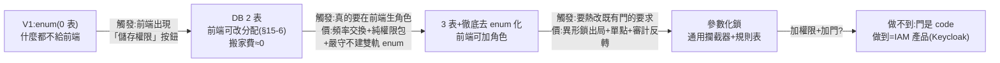

# 設計討論日誌 — 動態 RBAC 深挖:熱置換、參數化鎖、升級階梯(第四戰,2026-07-09~10)

> 承接:step2 日誌附錄「RBAC 三戰」(2 表 vs 3 表 vs 0 表)與觀念 14–21(該處為時序摘要,本檔為完整敘事版)
> 起點:與老師二度討論組態檔方案 —「在伺服器做 IO 把他換掉」;終點:升級階梯拍板 + 五關分析作業立案
> 範圍:改權限 / 加角色 / 加新權限的「動態化」能走多遠、每一步的價格 — Flyway vs Atlas 與 MongoDB 支線不在本檔(見 step2 觀念 17/18)
> 對應 design.md:§4.4(撤表+Q3+同格兩座位+前端分界)、§7(熱生效兩層)、§15-6(升級觸發)

---

## 0. 我的提問軌跡(原話,按時序 — 每一問撞出了什麼)

> 「所以 2 表架構的權限改動是熱生效嗎?老師的方案 前端能做出改權限跟加角色?」

→ 撞出**熱生效兩層拆解**(§2)與**前端能力三格表**(step2 觀念 14/15)。

> 「對齁 加了表多東西 我還是得改後端的 entity。能不能做出通用化 老師上課好像有教過?」

→ 撞出**通用化生死線**(水管 ✅ 語意 ❌、EAV 反模式;step2 觀念 16)。

> 「我講不清楚 但我要的是 前端一個按鈕 就能加角色 加權限。我先做分析」

→ 需求立案:**這是 IAM 產品(Keycloak)的本體需求** — 五關分析作業成立(§9)。

> 「放組態檔 這個今天又有跟老師討論。他說在伺服器做 io 把他換掉 這是甚麼概念?再定期更新嗎?就能做到熱置換?」

→ 撞出**配置外部化 + 熱重載**的完整拆解(§2)。

> 「其實前端改外部引入組態檔應該也是小事」

→ 被打:**lost update 在檔案上復活**、「小事」的估法(§2.4)。

> 「之前的 2 表板可以做到加角色改權限,3 表板可以做到加角色改權限加新權限,因為只要能 insert 多資料對吧?」

→ 錯誤假說,解剖於 §3:**資料存在 ≠ 產生效果**。

> 「這邊確實是盲點 我丟個字串 後端沒對應的權限字串也沒用對吧?」

→ 打通空殼檢驗 → 建立**鑰匙/鎖/門**模型(§1)。

> 「所以能不能一樣做後端權限熱置換?我不太懂」

→ 撞出**參數化鎖**(§5)— 五關第 4 關的答案在這裡被教掉。

> 「所以目前我的理解:①加腳色調權限沒問題 因為早就有對應的東西在後端了 ②加新權限就得參數化 ③有改動 jwt 的權限就得重登是嗎?」

→ 判卷:①半對(調權限 ✅ / 加角色漏前提)②因果接反 ③對 + 精緻化(快照 vs 每請求讀)(§4、§5.3)。

> 「沒有 我分成三表就沒這問題啊」

→ **我的反擊戰果**:3 表內建「去 enum 化」— 真實修正 AI 的表述;但帳要算完(§4)。

> 「所以我先用老師這版 再把他外部參數化 先不考慮併發 之後再實作併發。等到熟悉後 想要在前端玩可以 3 表版的改動 我再來考慮更深入的問題對吧?反正那時候知識更豐富了」

→ 路線提案 → **三個校準** + 升級階梯拍板(§6)。

---

## 1. 核心模型:鑰匙、鎖、門

一個權限要「活著」,是一條三環的鏈:

| 環節 | 比喻 | 住哪 |
|---|---|---|
| 權限的名字(`'REPORT_VIEW'`) | **鑰匙的齒形** | 資料(表 / enum / 檔案,隨便) |
| `@PreAuthorize("hasAuthority('REPORT_VIEW')")` 掛在某支 API 上 | **裝在門上的鎖** | **code,永遠是 code** |
| 矩陣把權限分給角色 → 登入載入 authorities | **把鑰匙發進某些人的鑰匙串(JWT)** | 資料 |

每次請求 = 拿口袋裡的鑰匙串去試那扇門的鎖。

- **INSERT 一個新權限字串 = 打了一把新鑰匙,但全系統沒有任何一扇門裝著對應的鎖** — 什麼都開不了。「加新權限」的完整動作 = 打鑰匙(資料)+ **裝鎖(code)** + 發鑰匙(矩陣)— INSERT 只完成三分之一。
- **反面案例(有鎖沒鑰匙)**:工程師打錯字寫了 `hasAuthority('STOKC_MANAGE')` — 這把鎖的齒形全世界沒有鑰匙配得上 → 該 API 對所有人**永遠 403**,且編譯過、啟動過,只在有人真的按下按鈕時以一個普通 403 現身。鎖端與鑰匙端的字串必須一字不差,而字串比對沒有編譯器站崗 — 二戰「typo 防護位置」的具象版。
- 這也是為什麼即使矩陣住 DB,Java 端的 Permission 仍值得 enum 化(`hasAuthority(Permission.STOCK_MANAGE.name())` 之類寫法讓鎖端至少有半個編譯器)— Step 7 施工時會真實面對。

---

## 2. 老師二招:配置外部化(externalized config)+ 熱重載

### 2.1 「在伺服器做 IO 把他換掉」是什麼概念

- **enum 方案**:矩陣編譯進 bytecode、活在 jar 裡 — 改 = 重編譯 + 重啟,別無他法。
- **老師這招**:矩陣寫成**不進 jar 的外部檔案**(如 `/config/permissions.yml`),程式啟動時讀進記憶體;要改權限 = 到伺服器上改/換那個檔案(一次檔案 IO)→ 程式**重讀** → 記憶體矩陣更新 → 下一個登入的人拿到新權限。全程不編譯、不重啟。
- 這招的正式名字:**配置外部化** — 12-factor app 的 config 原則(配置與代碼分離),業界核心素養;產品化的終點形態 = 配置中心(Nacos / Apollo / Spring Cloud Config)。

### 2.2 「定期更新嗎?」— 重讀的三種觸發

1. **輪詢(polling)**:排程每 N 秒比對檔案 mtime,變了才重讀 — `@Scheduled` 就能寫(老師說的「定期」= 這招)
2. **檔案監聽(file watching)**:Java NIO `WatchService`(OS 檔案事件)— 一變即知,即時
3. **手動觸發**:admin API(`POST /admin/reload-permissions`)

注意:**純 Spring Boot 沒有內建配置熱重載** — `@ConfigurationProperties` 只在啟動綁一次;要熱就得自己寫三招之一,或上 Spring Cloud(`@RefreshScope` + `/actuator/refresh`)。

### 2.3 「就能做到熱置換?」— 能,但有一個不變和三筆工程費

**不變**:熱生效要拆兩層(觀念 14)— 這招把**伺服器層**變熱(不部署),**token 層照樣冷**:authorities 是發 token 時的快照,已登入者要重登。熱置換置換的是矩陣,不是已發出去的 token。

**三筆工程費**:
1. **重讀觸發機制**(三選一)
2. **讀入驗證 + fail-fast**:yaml 字串沒有編譯器護體 — 讀檔時綁定 Permission enum,**綁不上就拒載、保留舊版**(壞檔不能讓系統靜默失權)
3. **換版本的併發安全**(我的主場):請求執行緒讀矩陣讀到一半、排程執行緒換版怎麼辦?— 矩陣做成**不可變(immutable)物件**,新版整份建好後用 `volatile` 引用**一次性替換**(安全發布 safe publication)— 讀者要嘛整份舊、要嘛整份新,永不見一半;檔案本身的替換也要原子(寫暫存檔再 rename)

### 2.4 檔案 vs DB:同格兩座位(+「小事」被打的完整記錄)

老師這招等於承認「矩陣要 runtime 可寫」— Q3 判準對這個需求的判決本來就是「搬出 code」。所以**檔案與 DB 不是對立方案,是同一格(code 之外的可變儲存)的兩個座位**:

| | 外置組態檔 | DB 表(2 表版) |
|---|---|---|
| 熱更新 | ✅(自己寫觸發+驗證+原子替換) | ✅(UPDATE 即生效於下次發 token) |
| 併發寫保護 | 自己搞(無交易無行鎖) | 交易、行鎖免費送 |
| **多實例(橫向擴 3 台)** | **殺手題**:每台一份會漂移;共享磁碟=自製窮人 DB | 天生一份真相 |
| 審計(誰改的、何時) | 自己搞 | updated_at / 流水表順手就有 |
| 前端按鈕改權限 | 做得到(API 寫檔+重讀)— 但已是在拿檔案當儲存層 | §15-6 本體 |

**「前端改外部組態檔應該也是小事」— 被打的過程**:happy path 確實幾行(API→驗證→寫檔→重讀),但兩個 admin 同時按儲存 = 讀整份 yaml → 改一格 → 整份寫回 = **read-modify-write 的 lost update 原地復活**(UcMarket 商家進貨的老朋友)— 且 DB 有條件更新/行鎖可救,**檔案什麼都沒有**;再加原子替換、審計、寫入驗證、「改權限的權限」自指問題 — 每項 DB 免費送、檔案手刻。

> **判準:「小事」不能用 happy path 行數估,要用「誰會同時用它、壞了會怎樣」估。** 前端改權限的真.小事版 = 前端 + DB 矩陣(§15-6),不是前端 + 檔案。

---

## 3. 錯誤假說解剖:「只要能 INSERT 多資料就能加」

我的假說原文:「2 表版可以做到加角色改權限;3 表版可以做到加角色改權限**加新權限** — 因為只要能 insert 多資料對吧?」

**給分**:「改權限(重新分配)」2 表 ✅ 3 表 ✅ — 鑰匙、鎖、門全存在,只是重新發鑰匙,純資料操作。

**事實錯誤**:**2 表版也有 permission 表**(2 表 = permission + role_permission,少的是 role 表)— 「3 表才能 INSERT 新權限」前提不成立,兩版的 permission 表能力完全相同;3 表多的 INSERT 能力只有一種:往 role 表插新角色的「名字」。

**死穴(空殼檢驗)**:`INSERT INTO permission VALUES ('REPORT_VIEW', ...)` 成功之後 — 打開 §14 API 表逐支看,**沒有任何一支 API 因此開始擋人**。我 INSERT 進去的不是「權限」,是「一個沒有任何 code 認識的字串」。

> **判準:「加 X」要拆成「X 的資料存在」和「X 產生效果」兩件事 — INSERT 只買得到前者。**
> 「能存 = 能加」是每個人的第一直覺,親手打破它,這題才是我的。

---

## 4. 三表反擊(我的戰果)與頻率透鏡

AI 判卷說「加角色要付兩個前提:①role 去 enum 化 ②新角色是純權限包」— 我反擊:

> 「沒有 我分成三表就沒這問題啊」

**擊中**:3 表版 role 是實體表、member.role_id 是 FK,JPA 映射普通關聯(`@ManyToOne`)不是 `@Enumerated` — 新角色 INSERT 進來讀取**不炸**。**前提①(去 enum 化)在 3 表方案裡是內建的 — 買 3 表時已付**。AI 認錯修正表述(我第三次真實修正 AI:一戰逼分層、二戰打 CHECK、這次補完前提)。

**但帳要算完 —「已付過」≠「免費」,付的正是二戰第一發的全額**:

拿 spec 真實的一行對照 — 註冊「只能建 CUSTOMER」(§14)的 `member.setRole(...)`:

- **2 表+enum**:`member.setRole(Role.CUSTOMER)` — 打錯字**編譯不過,IDE 紅線**
- **3 表(徹底無 enum)**:`roleRepository.findByCode("CUSTOMER")`(打成 `"CUSTOMR"` = runtime 才錯、靜默)或 `setRoleId(1L)`(1 是誰?seed 順序一變全錯)— 兩條路都是 runtime 雷

**雙軌 enum 陷阱**:3 表版寫業務代碼寫到受不了,實務上常偷偷建一個 Role enum 對照表資料 — 一建,雷全數回歸(enum 又沒有 ACCOUNTANT),還多一個同步點(enum ↔ role 表人肉對齊)。「徹底無 enum」是 3 表版「加角色不炸」的**紀律前提**,守不住就兩頭虧。

**前提②不動**:不炸 ≠ 有用 — 新角色要有任何專屬行為還是 code;純權限包角色才真的零 code,與表數無關。

> **頻率透鏡(新)**:判斷角色 = 每個請求、每行業務代碼都在發生(**高頻**);加角色 = 一年幾次(**低頻**)。
> 3 表的交換 = **為低頻操作(加角色免炸)優化,讓高頻操作(每次角色判斷)變脆 — 反向優化**。
> 多租戶 SaaS 為什麼願意付?因為頻率反轉:加角色高頻(每家店自訂)+ 判斷角色零頻(代碼零 hasRole)— 場景的頻率分佈一反轉,同一張交換表的答案就反轉。
> **Q2 完整版:2 表 vs 3 表 = 「日常型別安全」與「加角色免炸」的交換,用兩個操作的頻率比來判。**

---

## 5. 「後端權限熱置換」— 參數化鎖(五關第 4 關的答案,因我卡住而直接教)

### 5.1 死的那半:`@PreAuthorize` 不能熱,但真正的原因是門

註解是編譯進 class 的標記、啟動時建攔截(AOP proxy)— runtime 改不了。但最深的原因是:**鎖裝在門上,門本身就是 code** — 加新權限幾乎必然因為有新功能(新門),門要寫要部署,蓋門時順手裝鎖零加價。「加新權限 ❌」死得這麼透,卡的不是鎖,是門。

### 5.2 活的那半:鎖參數化 — 齒形要求變成資料

前提:**門已存在**,只想改「這扇門要求什麼齒形」:

- **寫死版**:每扇門一把專屬鎖 — `@PreAuthorize("hasAuthority('STOCK_MANAGE')")`
- **參數化版**:全系統一把**通用鎖**(統一攔截器 / 自訂 AuthorizationManager),邏輯一句:拿請求的路徑+方法查**規則表**,查出要求的齒形,比對鑰匙串:

```
規則表(資料!):
POST  /api/admin/menu-items/{id}/restock  →  STOCK_MANAGE
PATCH /api/admin/orders/{id}/status       →  ORDER_STATUS_MANAGE
```

齒形要求從 code 搬進資料 → 改「這支 API 要什麼權限」= 改表 = 熱;細分權限(一個拆兩個)= 規則表改兩行 + 矩陣補發鑰匙 = 不部署。**參數化的前提 = 所有鎖的檢查邏輯同構**(都是「鑰匙串包含 X 則放行」)— 業界完全體:API gateway 權限插件、政策引擎(OPA 政策外置熱載、Google Zanzibar)。

### 5.3 因果對齊 + 熱度判準

我曾說「加新權限就得參數化」— **因果接反**:參數化不是加新權限的解法(門的成本誰都救不了),它是**為「改既有門」買的選配熱改能力**;不參數化,加新權限照樣沒問題(寫註解+部署)。

> **熱度判準:看那份資料是「發 token 時讀一次」還是「每次請求都讀」** — 鑰匙串(authorities)被快照進 JWT,改了要重登;規則表是 server 每請求查的,改了**下一個請求立即生效**,不用重登。

### 5.4 參數化的代價(第 5 關素材)

1. **同構前提篩掉異形鎖**:spec 現成反例 — cancel 的授權「**本人 OR** ORDER_STATUS_MANAGE」(§14)不是一句「包含 X」,參數化不了,仍住 code。真實系統總有這種門
2. **規則表成為新單點**:錯一行 = 某支 API 裸奔或全鎖 — 而且熱生效的錯
3. **可讀性與審計反轉**:現在看 code 一眼知道誰守著這支 API;參數化後 code 裡什麼都看不到,安全審計從「讀 code」變「查庫+版本」
4. 蓋完這些 = 站在「另一個產品」(IAM / gateway)門口

### 5.5 邊界地圖(本輪總集)

| 東西 | 本質 | 能不能熱 |
|---|---|---|
| 鑰匙的名字(權限定義) | 資料 | ✅(DB / 外置檔) |
| 發鑰匙(矩陣分配) | 資料 | ✅ |
| 門要求什麼齒形(鎖的參數) | **可資料化** | ✅ — 前提:檢查邏輯同構(通用鎖+規則表) |
| 鎖的檢查邏輯本身 | code | 同構的寫一次通用鎖;異形的(本人 OR 權限)各自住 code |
| **門(功能本體)** | **code** | **永遠 ❌ — 新功能必部署** |
| 已發出去的 token | 快照 | 不管上面多熱,要重登 / 過期 / 版本號 |

> **熱的邊界 = 資料化的邊界。能把多少東西無損地變成資料,就有多少東西能熱 — 而門永遠不是資料。**

---

## 6. 升級階梯(拍板)與路線三校準

我的路線提案:「先用老師這版 → 再外部參數化 → 先不考慮併發之後再實作 → 熟悉後前端玩 3 表 → 那時知識更豐富了」。

**大方向對** — 延遲決策到**最後責任時刻(last responsible moment)**,且成立前提已驗過:搬家費已知且低(@PreAuthorize 零改動)。**搬得便宜,延遲才免費;搬家貴的(level→矩陣)不能延。**

**三個校準**:
1. **「外部參數化」對本案是多餘中繼**:手上有 PG,runtime 寫入需求出現那天直接 enum→DB。想練熱重載(WatchService/volatile 換版都是好功夫)= 標記為**練習圈支線**,架構需要與學習想要分開記帳
2. **「之後再實作併發」方向錯**:到時不是「在檔案上補併發控制」(手刻檔案鎖=自製窮人 DB 的開始),而是**併發需求出現=換座位的訊號**(去天生有交易/行鎖的 DB)
3. **「前端玩=3 表」把好幾階壓成一階**:前端**改分配**,2 表就夠(§15-6);3 表只在「前端**加角色**」才被逼出來,且要付頻率交換



**每一階等它自己的觸發訊號再上 — 不因「以後想玩」先跳階。**

---

## 7. 判準總表(本輪產出)

1. **資料存在 ≠ 產生效果** — INSERT 只買到「名字存在」;效果 = 有行為(code)掛著它
2. **熱的邊界 = 資料化的邊界;門永遠不是資料**
3. **快照 vs 每請求讀**:發 token 時讀一次的(鑰匙串)改了要重登;每請求讀的(規則表)改了立即生效
4. **「小事」用「誰會同時用它、壞了會怎樣」估,不用 happy path 行數估**
5. **頻率透鏡**:為低頻操作優化、讓高頻操作變脆 = 反向優化;場景頻率反轉,答案跟著反轉
6. **併發需求出現 = 換座位的訊號**,不是手刻併發控制的訊號
7. **最後責任時刻**:搬家費已知且低,延遲決策才免費
8. **同格兩座位**:檔案=單機/低頻/工程師手改的輕量位;多實例/前端改/要審計=DB 位
9. (承觀念 17)**新技術動的位置 ≠ 你卡住的位置 = 無效藥**

---

## 8. 【AI 幫想的】我考慮不完備的地方(每條自己過一遍,決定收不收)

> 這節是我點名要 AI 補的盲區 — 不是定案,是待我消化的清單。

1. **降權的急迫性不對稱(最重要的一條)**:全程討論都在講「加/改」,沒人講「**收回**」— 給人升權可以懶惰生效(等重登),**降權/封禁不能等**:開除員工的那一刻,他手上的 token 還有效 7 個多小時(V1 時效 8h)。「拿走」永遠比「給予」急 — 這是 §7.4 token_version 的真正殺手場景,也是任何動態權限系統的第一個安全需求。升降權的生效策略要分開設計。
2. **權限管理功能自身,是全系統最高價值的攻擊面**:「改權限的 API」被打穿 = 全系統淪陷。自指問題只碰到一半 — 完整版:①bootstrap:第一個 admin 怎麼來?(seed)admin 把自己鎖死怎麼辦?(恢復路徑)②**提權(privilege escalation)**:能改權限的人能不能給自己加權限?③**審計不可繞過**:改權限必留痕,且痕跡不能被同一人刪 — 企業 IAM 為此有雙人複核(four-eyes principle)
3. **需求真實性(最上位的盲點)**:整條討論沒問過「**誰**要在前端改權限?多常?」— EatRush 單店,operator=店長一人,前端權限管理的真實使用者可能不存在。功能的第一題是 who + how often,不是 how — 面試官會問「這功能給誰用」,工程再漂亮,答不出使用者就是白蓋
4. **失敗要有聲音**:fail-fast 保舊版講過了,但「靜默保舊版」= 改的人以為改了、其實沒生效 — deployer 視角的靜默失敗。重載成功/失敗要有訊號(log/metric/API 回應);更遠一步:規則表版本與 code 版本的偏移(version skew)— 部署新 code 但規則是舊的(或 rollback code 時規則要不要跟著回)
5. **測試稅**:靜態 enum 版,權限測試可窮舉(角色×API 有限);動態版,測「改了規則之後」的行為 = 測試要能操作規則資料、要測熱重載時序 — 測試成本是動態化的隱藏稅,第 5 關記帳別漏
6. **每請求查庫版的快取回歸**:若未來為「即時生效」改成每請求查權限,權限查詢就進了熱路徑 → 要快取 → 快取失效策略(改矩陣→DEL)— cache-aside 的整套知識會在權限場景重演,與菜單快取同構
7. **進階兩則(遠期)**:①一人多角(user_role 五表模型)動態化後的**合成語意** — 兩個角色的權限集矛盾時聽誰的(deny 優先還是 allow 聯集)?②規則表的 **pattern 重疊優先序** — `/api/admin/**` 與 `/api/admin/orders/{id}` 同時匹配時誰先?(Spring Security requestMatchers 順序敏感,規則進了資料就要管順序)

---

## 9. 五關分析作業(自 step2 日誌移入 — 主題歸位)

需求陳述:**營運者在前端介面上,不經工程師、不改 code、不部署 — 按一顆按鈕就能新增角色、新增權限並配好矩陣,且立即產生實際的擋人效果。**(= Keycloak/Auth0 的核心需求;分析的是「完整代價是什麼、值不值得在 EatRush 付」)

1. 「加權限」按下去的完整旅程 trace:`'REPORT_VIEW'` 進 DB 之後呢?它要擋誰?`@PreAuthorize` 那行是誰、**什麼時候**寫的?(§1 已建模 — 用自己的話重走)
2. 空殼檢驗:沒有任何 code 掛著新字串時,按鈕加出來的是什麼?(§3 已解剖 — 用自己的話重走)
3. 「列/欄/code」掃四樣:角色、權限、矩陣、行為 — 各自天生住哪?哪樣搬不動?
4. 搬不動的那樣能不能預先通用化?(§5 參數化鎖已教 — 消化後用自己的話收進來,含同構前提與異形鎖反例)
5. **代價總帳(剩餘主戰場)**:去 enum 化、頻率交換、雙軌 enum 紀律、lost update、審計、自指、降權急迫性、測試稅、§8 各條…全記上,最後答:**做完這些,它還是 EatRush,還是另一個產品?**

【分析待交 — 你寫。1、2、4 關的答案已在本檔被教掉,你的作業=用自己的話串成一條線 + 把第 5 關的帳算完 + 過一遍 §8 決定收哪些】

---

## 一句話帶走

**熱的邊界 = 資料化的邊界,門永遠不是資料;而「能不能做」的上面還有一題 —「誰要用、多常用」。**
